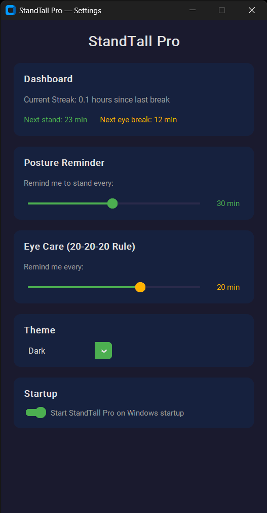

# StandTall Pro

A cross-platform desktop app that reminds you to stand up and rest your eyes, featuring a system tray icon and customizable settings.

## About

StandTall Pro is a health-focused utility designed for people who spend long hours at their desk. Prolonged sitting and screen staring can lead to back pain, poor posture, and digital eye strain. This app runs quietly in your system tray and sends timely reminders to stand up, stretch, and give your eyes a break using the 20-20-20 rule, helping you build healthier work habits without disrupting your flow.



## Features

- **Posture Reminders** — configurable intervals (1-60 min) to remind you to stand up
- **Eye Care (20-20-20 Rule)** — configurable intervals (1-30 min) to remind you to look away from the screen
- **System Tray** — runs in the background with quick access to Settings, Pause/Resume, and Quit
- **Custom Themes** — Dark, Light, and High Contrast
- **Auto-start** — option to launch on system startup
- **Desktop Notifications** — native notifications on Windows, macOS, and Linux
- **Streak Tracking** — shows time since your last break
- **Cross-platform** — works on Windows, macOS, and Linux

## First Launch

On the very first run, the settings window opens automatically so you can configure your preferences. After that, the app starts silently in the system tray. Right-click the tray icon to open Settings at any time.

## Installation

### Run from source

```bash
git clone https://github.com/akshaykpillai369-max/StandTall.git
cd StandTall
pip install -r requirements.txt
python src/main.py
```

### Build standalone package

Standalone packages don't require Python — they bundle everything needed.

**Windows** (builds `dist/StandTall Pro/StandTall Pro.exe`):

```bash
build.bat
```

**macOS** (builds `dist/StandTall Pro.app`):

```bash
chmod +x build_mac.sh
./build_mac.sh
```

**Linux** (builds `dist/StandTall Pro/`):

```bash
chmod +x build_linux.sh
./build_linux.sh
```

## Configuration

Settings are stored in `config.json`:

| Key | Default | Description |
|-----|---------|-------------|
| `stand_interval_seconds` | 3600 | Interval between stand reminders (seconds) |
| `eye_care_interval_seconds` | 1200 | Interval between eye care reminders (seconds) |
| `eye_care_duration_seconds` | 20 | Eye break duration (seconds) |
| `theme` | `"dark"` | UI theme (`dark`, `light`, `high_contrast`) |
| `start_on_boot` | `false` | Launch on system startup |
| `notifications_enabled` | `true` | Enable/disable desktop notifications |

## Tech Stack

- [CustomTkinter](https://github.com/TomSchimansky/CustomTkinter) — modern UI
- [pystray](https://github.com/moses-palmer/pystray) — system tray icon
- [Pillow](https://python-pillow.org/) — image processing
- [PyInstaller](https://pyinstaller.org/) — builds standalone packages

## License

MIT
